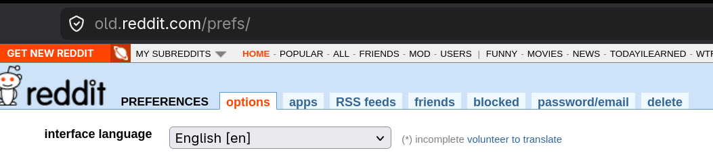

# Frequently asked questions

1. Why can't I login?

There can be issues with `Android System Webview`. See [Common errors](/SETUP.md#common-errors) in [SETUP.md](/SETUP.md).

There is a known issue with the `Reddit` login JavaScript. It was discovered by wchill. It prevents logging in when the language if the language is anything other than `English`. So you need to set the language of your `Reddit` account to `English`.

I have implemented a hack to workaround the issue in `8.1.4.5`, but it has a few issues.

1. It could break at anytime if `Reddit` rewrites their JavaScript.
2. The hack only works in the WebView not Chrome, Brave or Firefox.

## How to change the Reddit account interface language
1. Go to https://old.reddit.com/prefs/
2. Change the `interface language`

  <picture>
    <source
      width="1053x"
      media="(prefers-color-scheme: dark)"
      srcset="assets/screenshots/reddit_account_language.png"
    >
    
  </picture>

Sometimes there can be popups on the login page, like a cookies popup, that block the keyboard appearing. Real browsers deal with these better than `Android System WebView`.

There is also a button in the bottom right of the login screen that lets you use your default browser instead of `Android System WebView`. But the browser needs to be `Chrome` based like `Chrome`, `Chromium`, or `Brave` to work. It has been tested with `Firefox`, and it doesn't work.

Using a VPN from a location other than your actual location, or if already using a VPN, not using a VPN. You may also get difference results on different internet connections, like your home, friend's home, grocery store, work, etc. Also if wifi isn't working try the cell connection. If the cell connection isn't working, try wifi.

2. Why can't I view `NSFW` content even through I have enabled the settings in `Settings | Content NSFW Filter`?

The behavior of this seems to be per account. The known fix, when it is an issue, is to make a subreddit via the website as the user you want to use in `Continuum`. This makes you a `moderator` of your new subreddit. This seems to set a flag on the account that then solves the problem.
